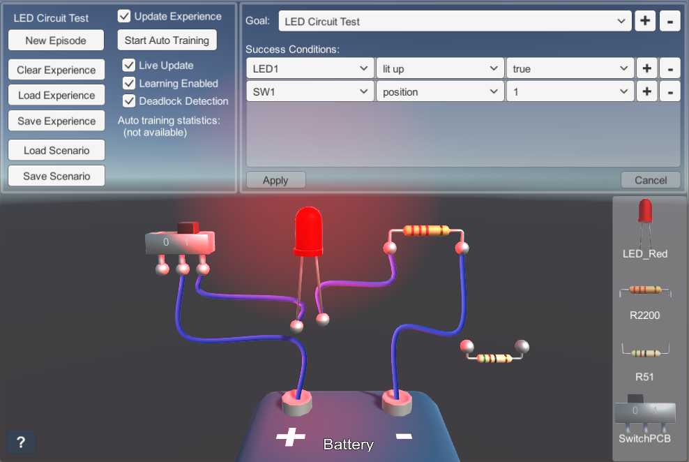

#  Digital Scenario Framework Test for Unity

This [Unity] project is based on the Digital Scenario Framework for .NET ([DigitalScenarioFrameworkNET]) project (a .NET binding for the [Digital Scenario Framework] project). This project is based on the simplified electronic circuit test case of [Digital Scenario Framework] project. Specific behavior of electronic components are implemented as visual effects, like lighting up a LED or moving a switch cursor.
A point-and-click interaction is implemented to connect electronic components and to activate switches. Cables are automatically created and added to the scene to show the connections among electronic components. Electronic components can be selected and dragged to change their positions. 
A user interface (UI) was developed to load and save the scenario configuration, to control the experience management, to test the automatic training and to define goals and success conditions.
Please note that this UI provides a limited access to the Digital Scenario Framework API, both the .NET binding and the UI must be updated to cover all the functionalities exposed by the main C++ API (in *DiScenFw* DLL).

 

*A screenshot from the LedCircuitTest scene.*

### Remarks
Please note that: 
* **this project is a just a test for the Digital Scenario Framework, not a circuit simulation;**
* **the circuit simulation is very simplified and does not reflect the real behavior;**
* this version works only for Windows 64 bit, anyway it can work with other platforms if the *DiScenFw* and *DiScenFwNET* binaries for other platforms are available.

## Related projects

### Digital Scenario Framework

[Digital Scenario Framework] is a programming interface for digital scenarios, designed to study the collaboration between human and artificial intelligence (AI), applied to a generic digital scenario.

A wrapper was developed for the C++/STL framework library (*DiScenFw*) with a C-style programming interface that can be used in any platform for which suitable binaries are provided.

### Digital Scenario Framework for .NET

A binding for .NET platform (*[DigitalScenarioFrameworkNET]*) was developed upon that wrapper, mainly to test the framework also with [Unity].

**Please note that this binding is not yet complete and can be not up to date with the original [Digital Scenario Framework] library.**

**Note:** It is possible in *[DigitalScenarioFrameworkNET]* Visual Studio project to automatically update binaries in the [UnityDigitalScenarioTest] project folders: just set the variable `UNITY_TEST_ROOT` in *DiScenFwNET Properties|Build Events|Post-build event command line* to the path of Unity test project.

### Unreal Scenario Test

Also the [UnrealScenarioTest] project is based on the simplified electronic circuit test case, but was developed using [Unreal Engine 4].

## Supported Platforms
This project was developed with [Unity] 2018.1 and is only tested with *DiScenFw* DLL for Windows (x64) platform at the moment.

## Licensing

The project is [licensed](/LICENSE.txt) under the [MIT license](https://opensource.org/licenses/MIT). This means you're free to modify the source and use the project in whatever way you want, as long as you attribute the original authors.

## Contributing

Please notice that this project is just a test for the [Digital Scenario Framework] interoperability support, thus the author's development effort is focused more on [Digital Scenario Framework] project.

Anyway, if you find bugs or you have any new idea for improvements and new features you can create an issue on GitHub. To open issues or make pull requests please follow the instructions in [CONTRIBUTING.md](https://github.com/gpvigano/UnrealScenarioTest/blob/master/CONTRIBUTING.md).

## Contact ##

Follow Digital Scenario Framework project updates on [GitHub](https://github.com/gpvigano/DigitalScenarioFramework).

The best way to get support is via the [GitHub page](https://github.com/gpvigano/UnityDigitalScenarioTest), using the GitHub platform.
Anyway if you cannot use GitHub you can contact the author writing to [GPV](mailto:gpv.code@gmail.com).

## Acknowledgements

This project includes [EasyCurvedLine](https://github.com/gpvigano/EasyCurvedLine) package for cables visualization and some utility scripts from [GPVUDK](https://github.com/gpvigano/GPVUDK).

Some 3D models of electronic components were created with [Blender](http://www.blender.org/) and imported both into Unreal Engine and Unity projects.

Some icons were created with [GIMP](https://www.gimp.org/) for visual hints and user interface.

[Digital Scenario Framework]: https://github.com/gpvigano/DigitalScenarioFramework
[UnrealScenarioTest]: https://github.com/gpvigano/UnrealScenarioTest "Digital Scenario Framework Test for Unreal Engine"
[DigitalScenarioFrameworkNET]: https://github.com/gpvigano/DigitalScenarioFrameworkNET "Digital Scenario Framework for .NET"

[Unity]: https://unity.com/
[Visual Studio]: https://visualstudio.microsoft.com/
[Unreal Engine 4]: https://www.unrealengine.com

